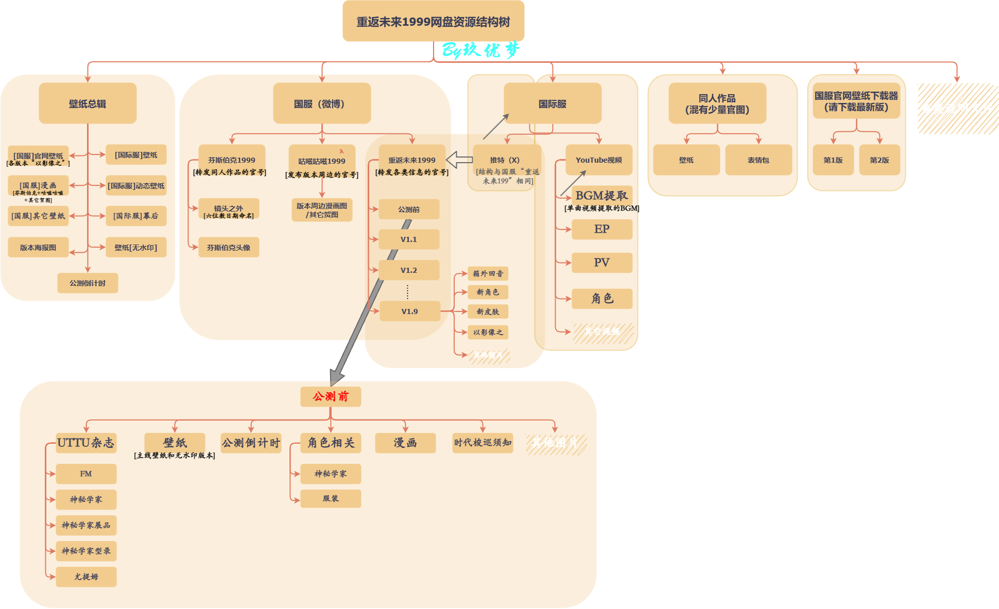

# Download-Reverse1999

## 项目介绍

> <u>*本项目仅用于批量获取1999国服官网的图片下载链接，仅作为技术分享，请勿用于其他用途。侵权请联系删除。*</u>
>
> 项目地址：[Gitee@默默](https://gitee.com/MuXi-Dream/download-reverse1999) ；[GitHub@默默](https://github.com/ADarkDream/Download-Reverse1999) ; [API文档](https://apifox.com/apidoc/auth-shared-70082832-e502-49ac-a386-35af15bfd747?redirect=%2Fshared-70082832-e502-49ac-a386-35af15bfd747%2Fapi-186774719&&type=shareDoc)
>
> API文档主要是壁纸链接表及角色信息表，用于给图片分类，见下方“默默的小站”。如有需要API文档可找我要密码
> 
> 为方便使用，已将本项目功能上线，可前往[默默的小站](https://muxidream.cn/reverse1999)分类筛选并下载([详见方案三](#mark三通过网站下载壁纸mark))
>
> 其它联系方式：[微博@玖优梦](https://weibo.com/u/6869134755)（**微博私信我会自动回复链接**）
>
> 如果你嫌麻烦，我有已整理好的绝大多数官方国服和国际服的图片资源：
>
> 百度网盘链接：[重返未来1999](https://pan.baidu.com/s/1A4o9VM4kPa_vzWZEtHiZSA?pwd=1999)
>
>  
>
> 详细说明请见微博专栏第七篇文章：[微博@玖优梦的专栏文章](https://weibo.com/ttarticle/x/m/show#/id=2309404942430960222221&_wb_client_=1)
> 
> 其实不看也罢，因为没微博会员不能修改文章，所以挺久没更新了
> 
> 在线文档：[1999资源总表：金山云文档](https://kdocs.cn/l/cjkqngyqWLTI#3)

## 主要文件
>   `download.js` 方案一和方案二，主要脚本文件
> 
>  `1999server.js` 仅用于方案三，解决批量下载深蓝官网壁纸的跨域问题
> 
>   `package-lock.json` 锁定安装时的包版本号
> 
>   `package.json` 锁定安装时的包版本号
> 
>   `url.txt` 初始下载链接

## 使用教程

### <mark>一、源代码使用教程</mark>

#### 1.  克隆本项目到本地
#### 2.  在控制台输入 `npm install` 安装依赖
#### 3.  在控制台输入`node download.js`开始执行脚本

### <mark>二、EXE使用教程</mark>

> ​    注意事项：
>
> ​    （1）请使用**Windows 64位**电脑
>
> ​    （2）请先确认你有`download.exe`文件，如果没有，请从本项目右侧发行版本下载最新版；或从上方介绍中**度盘链接**中的**国服官网壁纸下载器**文件夹内下载**最新版压缩包**并解压
>
> 

#### 1.前往1999国服官网壁纸页面

​    [点击前往](https://re.bluepoch.com/home/detail.html#wallpaper)

#### 2.复制要下载的图片链接

​    (1)**下载全部图片**:因为官网图片是动态加载，如果你需要下载所有图片，要一直滑动到页面底部，等图片全部加载好了再进行下一步操作；

​    (2)**下载部分图片**：如果你只需要下载部分图片，那么等到你想下载的部分加载完毕即可进行下一步操作。

#### 3.打开浏览器开发者工具（F12键/Fn+F12键）

​    （1）找到类名为：`papermask-mid`的盒子`
这里是图片链接
`，【注意：**ctrl+F键**搜索可快速查找】

​    （2）然后**鼠标右键**，选择**编辑为HTML**，

​    （3）然后**CTRL+A键**全选代码，**复制**   *【如下图一】*

        【注意：当你鼠标指着一部分代码的时候，网页中会用阴影标识出你指的那一块区域，如下图一左半部分】

        【注意：如果后续发现图片数量不对的话，可以按上述步骤将所有`class=“class=papermask-mid-list”`之中的代码全部复制下来（就在`papermask-mid`的下级菜单中），不用担心文件重复，最后重命名会自动去重】 *【如下图二】*

 

 

#### 4.保存下载链接

​    新建 `url.txt` 文件，将第3步中复制的代码全部**粘贴**到txt文件中，**CTRL+S键**快速保存

#### 5.开始下载

​    双击 `download.exe` 即可进行下载

### <mark>三、通过网站下载壁纸</mark>
> ​    说明：
>
> ​    （1）为方便使用，已将本项目功能上线
>
> ​    （2）1999server.js 仅用于解决批量下载深蓝官网壁纸的跨域问题
>
> ​    （3）网站仅支持下载图片，不返回图片各项信息；如需 [图片信息API](https://apifox.com/apidoc/shared-70082832-e502-49ac-a386-35af15bfd747/api-186774719) 请联系我获取密码
> 
#### 1.  克隆本项目到本地
#### 2.  在控制台输入 `npm i` 安装依赖
#### 3.  在控制台输入`node 1999server.js`开始执行脚本
#### 3.  打开 [默默的小站](https://muxidream.cn/reverse1999) 进行下载

## 已知bug

##### ~~1.命名问题~~（V1.2.2已修复）

​	~~深蓝壁纸图片命名有问题，所以图片分类和url分类可能有问题，现在还需要自己手动改一下，等之后有空了再解决~~

##### 2.下载图21,23会报错

​	[方案一和方案二]下载图21和23时会出错，暂时还不清楚是为什么，遇到报错可以尝试手动下载

##### 3.网速较低会有大量图片下载出错

​	[方案一和方案二]没有对并发下载作出限制，网速很好(大概每秒几十兆)能正常下载全部图片，低于十兆每秒就会出现大量图片下载出错，可以尝试手动分批次下载，每次下载几十张图没问题的，之后有空再优化

## 参与贡献

1.  Fork 本仓库
2.  新建 Feat_xxx 分支
3.  提交代码
4.  新建 Pull Request

PS：好吧，上述步骤我也不太懂，联系我就行了