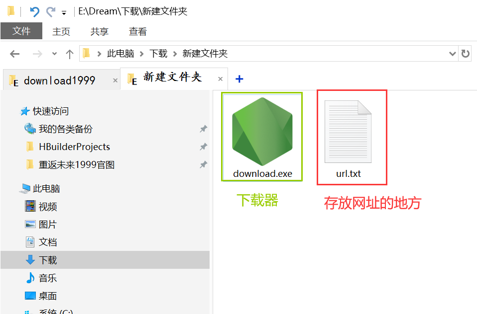
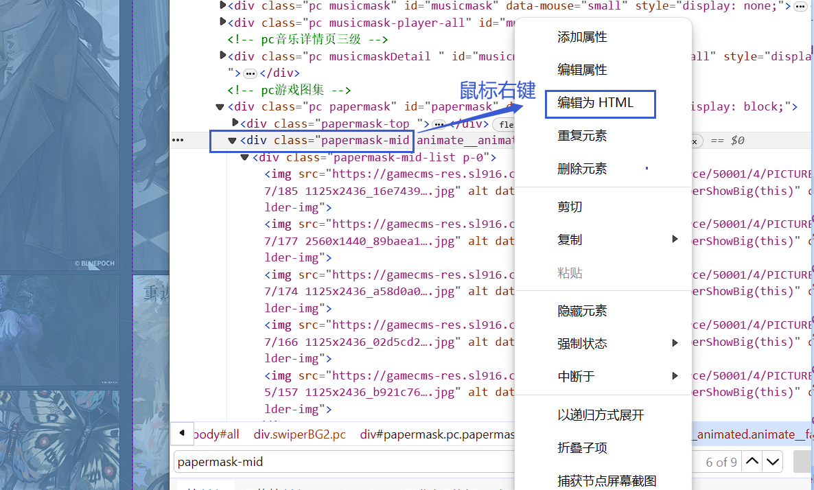

# Download-Reverse1999

## 介绍
1999国服官网壁纸下载

## 软件架构
软件架构说明

## 安装教程

1.  在控制台输入 `npm i` 安装依赖
2.  在控制台输入`node download.js`开始执行下载
3.  xxxx

## 使用说明

### <mark>**声明**</mark>

> <u>*本教程仅用于批量获取1999国服官网的图片下载链接，仅作为技术分享，请勿用于其他用途。侵权请联系删除。*</u>
>
> 联系方式：[微博@玖优梦]（`微博私信我会自动回复链接`）
>
> 如果你嫌麻烦，我有已整理好的绝大多数官方国服和国际服的图片资源：
>
> 度盘链接：[点击前往百度网盘](https://pan.baidu.com/s/1A4o9VM4kPa_vzWZEtHiZSA?pwd=1999)
>
> 文件夹分类说明请见微博专栏第七篇文章：[微博@玖优梦的专栏文章](https://weibo.com/ttarticle/x/m/show#/id=2309404942430960222221&_wb_client_=1)
> 预防网盘链接失效可以保存：[1999资源总表：金山云文档](https://kdocs.cn/l/cjkqngyqWLTI)

### <mark>准备</mark>

> ​    （1）请使用 `Windows 64位`电脑
>
> ​    （2）请先确认你有`download.exe`文件，如果没有，请从上面`度盘链接`中的`国服官网壁纸下载器>第2版`文件夹内下载`压缩包`并解压
>
> 

### <mark>教程</mark>

#### 1.前往1999国服官网壁纸页面

​    [点击前往](https://re.bluepoch.com/home/detail.html#wallpaper)

#### 2.复制要下载的图片链接

​    (1)`下载全部图片`:因为官网图片是动态加载，如果你需要下载所有图片，要一直滑动到页面底部，等图片全部加载好了再进行下一步操作；

​    (2)`下载部分图片`：如果你只需要下载部分图片，那么等到你想下载的部分加载完毕即可进行下一步操作。

#### 3.打开浏览器开发者工具（`F12键/Fn+F12键`）

​    （1）找到类名为：`papermask-mid`的盒子`
` `class="papermask-mid"`，【注意：`ctrl+F键` 搜索可快速查找】

​    （2）然后`鼠标右键`，选择`编辑为HTML`，

​    （3）然后`CTRL+A键`全选代码，`复制`   *【如下图一】*

        【注意：当你鼠标指着一部分代码的时候，网页中会用阴影标识出你指的那一块区域，如下图一左半部分】

        【注意：如果后续发现图片数量不对的话，可以按上述步骤将所有`class=“class=papermask-mid-list”`之中的代码全部复制下来（就在`papermask-mid`的下级菜单中），不用担心文件重复，最后重命名会自动去重】 *【如下图二】*

 

 

#### 4.保存下载链接

​    新建 `url.txt` 文件，将第3步中复制的代码全部`粘贴`到txt文件中，`CTRL+S键`快速保存

#### 5.开始下载

​    双击 `download.exe` 即可进行下载

## 已知bug

##### 1.命名问题

​	深蓝壁纸图片命名有问题，如下图，所以图片分类和url分类可能有问题，现在还需要自己手动改一下，等之后有空了再解决

 

## 参与贡献

1.  Fork 本仓库
2.  新建 Feat_xxx 分支
3.  提交代码
4.  新建 Pull Request