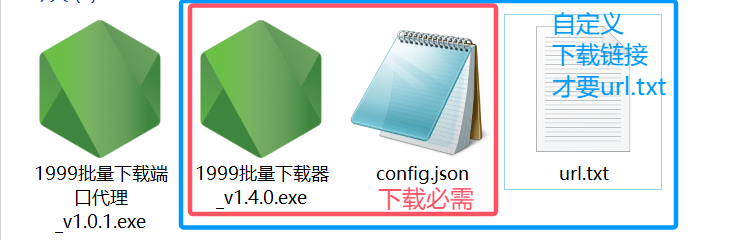

# Download-Reverse1999[v1.4.0]

## 项目介绍

> *本项目仅用于批量获取1999国服官网的以影像之图片的信息，仅作为技术分享，请勿用于其他用途。侵权请联系删除*
>
> 项目地址：[Gitee@默默](https://gitee.com/MuXi-Dream/download-reverse1999) ；[GitHub@默默](https://github.com/ADarkDream/Download-Reverse1999) ; [API文档](https://apifox.com/apidoc/auth-shared-70082832-e502-49ac-a386-35af15bfd747?redirect=%2Fshared-70082832-e502-49ac-a386-35af15bfd747%2Fapi-186774719&&type=shareDoc)
>
> API文档主要是壁纸链接表及角色信息表，用于给图片分类，见下方“默默的小站”。如有需要API文档可找我要密码
>
> 为方便使用，已将本项目功能上线，可前往[默默的小站](https://muxidream.cn/reverse1999)分类筛选并下载(详见下方方案三)
>
> 其它联系方式：[微博@玖优梦](https://weibo.com/u/6869134755)
>
> 如果你嫌麻烦，我有已整理好的绝大多数官方国服和国际服的图片资源：
>
> 百度网盘链接：[重返未来1999](https://pan.baidu.com/s/1A4o9VM4kPa_vzWZEtHiZSA?pwd=1999)
>
> 
>
> 详细说明请见微博专栏第七篇文章：[微博@玖优梦的专栏文章](https://weibo.com/ttarticle/x/m/show#/id=2309404942430960222221&_wb_client_=1)。其实不看也罢，因为没微博会员不能修改文章，所以挺久没更新了
>
> 在线文档：[1999资源总表：金山云文档](https://kdocs.cn/l/cjkqngyqWLTI#3)

## 主要功能

1、重返未来1999以影像之壁纸批量下载
2、本地服务器代理，以供默默的小站批量下载，网站具有更详细的筛选功能
3、下载器自1.4.0起支持版本更新检查，且可以通过`config.json`进行部分配置修改

## 主要文件

 方案一和方案二
>
> `download.js` 主要脚本文件，本地下载和代理服务器
>
> `function.js` 函数文件
>
> `dictionary.js` 字典，用于部分图片排序和命名
>
> `config.json` 下载器配置文件
>
> `url.txt` 指定的下载链接(可选)
>
> >`package-lock.json` 锁定安装时的包版本号
> >
> >`package.json` 安装的包版本号
>
> `README.md` 使用说明，本文档
>

 方案三
> `1999server.js` 仅用于方案三，解决网站批量下载深蓝官网壁纸的跨域问题(用网站后端代理或者云存储，我的带宽撑不住)，本地代理服务器
>
> >`package-lock.json` 锁定安装时的包版本号
> >
> >`package.json` 安装的包版本号
>
> `README.md` 使用说明，本文档
>

注：三种方案中的`package-lock.json` 和 `package.json` 是同一份文件

## 使用教程

### 一、源代码使用教程

#### 1.  克隆本项目到本地

#### 2.  在控制台输入 `npm install` 安装依赖

#### 3. 修改`config.json`文件

>请注意，修改`config.json`文件必须使用**英文符号**，键名需要**双引号**，键值如果是字符串也要使用双引号
>当要使用深蓝官方接口时，脚本所在目录一定不能有`filePath`指向的文件，否则不会使用深蓝官方接口获取图片链接，而是使用`filePath`指向的文件中的链接。
>
`config.json`详细说明如下：

``` json
{
    /*
      本地服务器启动模式，当mode为"server"时为代理服务模式(方案三)，不会自动开始下载图片，如果只需要代理，也可以选择只启动1999server.js[独立的代理服务器]；
      当mode为"download"时为下载模式，此时会继续运行下载任务，同时也开启了代理服务
     */
    "mode": "download",

    //本地服务器端口号,您可以使用绝大部分端口
    "port": 3000,

    //每次启动时检查更新,false为关闭
    "isCheckUpadte": true,

    //检查到更新时的等待时间，单位毫秒,isCheckUpadte为true时生效
    "waitTime": 5000,

    //横屏图片存储路径
    "PCDir": "./image/PCImg/",

    //竖屏图片存储路径
    "phoneDir": "./image/phoneImg/",

    //链接处理后的文件存放路径
    "listPath": "./urlList/",

    //线程数，最大并发下载数量
    "maxConcurrent": 3,

    /*下载方式有以下两种
      【方式一】：自行指定下载链接
      filePath指向存放1999图片链接的txt文件路径(当你想要精确指定需要下载哪些图片时，可以创建这个文件，用常用字符分割间隔即可,链接获取方式可参考exe方案)
    */
    "filePath": "./url.txt",

    /*【方式二】：使用深蓝官方接口（当filePath指向的文件不存在时自动尝试方式二）
      在targetVersions中填写你要下载的版本,多个版本用英文逗号隔开
      如下载1.4和1.5版本的壁纸，填写[14,15],
      如要下载所有版本的壁纸，保持为空：[]
      */
    "targetVersions": [],

    /*图片版本信息(因为官方上传时间间隔不固定，不太好判断，所以这里暂时枚举版本信息，每次官方更新时需要自行增添)
    如果你不知道对应版本时间，请查看最新的壁纸链接，如下方链接中"PICTURE"之后的数字"20241126"就是该版本以影像之更新日期。
    https://gamecms-res.sl916.com/official_website_resource/50001/4/PICTURE/20241126/386 1440x2560_b6e03c4928114c25aeb30df0969915e7.jpg
    一般情况下，一个版本通常只有一个日期，但是有例外情况，如1.3版本官方分两次上传图片，则有两个日期，那么就是[20231003, 20231031]  */
    "version":[
        {
            "time": [20230325, 20230328],  //官方更新以影像之的时间
            "version": 10,  //版本号
            "versionName": "V1.0_公测及之前"  //版本名称
        },
        {
            "time": [20230712],
            "version": 11,
            "versionName": "V1.1_雷米特杯失窃案"
        }
        //省略若干条版本信息......
        //若不匹配则默认版本号为1999，名称为"其他版本"
        ]
}           
```

#### 4. 在控制台输入`npm run start`开始执行脚本

### 二、64位EXE使用教程

> ​    注意事项：
>
> ​    （1）请使用**Windows 64位**电脑(偷懒只打包了64位程序)
>
> ​    （2）请先确认你有**1999批量下载器.exe**文件和**config.json**配置文件，如果没有，请从本项目右侧发行版本中下载最新版；或从上方介绍中**度盘链接**中的**国服官网壁纸下载器**文件夹内下载**最新版压缩包**并解压
>
> ​    （3）**首次运行会弹出联网权限申请，此次下载会失败**，同意权限后重新打开exe即可
>
> 

#### 1.下载全部图片或部分版本的图片

&ensp;&ensp;&ensp;&ensp;**1.3.0版本更新了下载链接获取方式(直接使用官方API)，故后续版本可以直接运行EXE程序下载图片,且可以通过`config.json`进行部分配置修改**

#### 2.下载部分图片【操作繁琐，强烈不推荐】

​    (1) [点击前往1999国服官网壁纸页面](https://re.bluepoch.com/home/detail.html#wallpaper)

​    (2)如果你只需要下载一小部分，那么找到你想下载的部分图片并等待其加载完毕即可进行下一步操作。

#### 3.打开浏览器开发者工具（F12键/Fn+F12键）

​    （1）找到类名为：`papermask-mid`的盒子`<div class="papermask-mid">这里是图片链接</div>`，【注意：**ctrl+F键**搜索可快速查找】

​    （2）**鼠标右键**，选择**编辑为HTML**，

​    （3）**CTRL+A键**全选代码，**复制**   *【如下图一】*

        【注意：
1、当你鼠标指着一部分代码的时候，网页中会用蓝色半透明阴影标识出你指的那一块区域】【如下图一左半部分】
2、每个`class=“class=papermask-mid-list”`之中的图片链接，在网页中是纵向分布的
3、如果后续发现图片数量不对的话，可以按上述步骤将所有`class=“class=papermask-mid-list”`之中的代码全部复制下来（就在`papermask-mid`的下级菜单中），不用担心文件重复，最后重命名会自动去重】 *【如下图二】*

 

 

#### 4.保存下载链接

​    新建 `url.txt` 文件(请查看`config.json`中的`filePath`设置的文件名)，将第3步中复制的代码全部**粘贴**到txt文件中，**CTRL+S键**快速保存

#### 5.开始下载

​    双击 `download.exe` 即可进行下载

### 三、通过网站下载壁纸【强烈推荐】
>
> ​    说明：
>
> ​    （1）为方便使用，已将本项目功能上线至个人站点
>
> ​    （2）1999server.js 仅用于解决批量下载深蓝官网壁纸的跨域问题(其实只是为了省我的流量)
>
> ​    （3）网站仅支持下载图片，不返回图片各项信息；如需 [图片信息API](https://apifox.com/apidoc/shared-70082832-e502-49ac-a386-35af15bfd747/api-186774719) 请联系我获取密码
>
#### 1.克隆本项目到本地

#### 2.  在控制台输入 `npm i` 安装依赖

#### 3.  在控制台输入`npm run server`开始执行脚本

也可以按第一大点中，将`config.json`的mode改为"server"，这同样是代理模式

#### 4.  打开 [默默的小站](https://muxidream.cn/reverse1999) 进行下载

## 已知bug

### ~~1.命名问题~~

V1.2.2已修复
​ ~~深蓝壁纸图片命名有问题，所以图片分类和url分类可能有问题，现在还需要自己手动改一下，等之后有空了再解决~~

### ~~2.下载图21,23会报错~~

~~V1.2.4已修复，加入重新下载功能~~
v1.4.0已修复，加入线程池控制
​ ~~[方案一和方案二]下载图21和23时会出错，暂时还不清楚是为什么，遇到报错可以尝试手动下载~~

### ~~3.网速较低会有大量图片下载出错~~

~~V1.2.4已修复，加入重新下载功能~~
v1.4.0已修复，加入线程池控制
​ ~~[方案一和方案二]没有对并发下载作出限制，网速很好(大概每秒几十兆)能正常下载全部图片，低于十兆每秒就会出现大量图片下载出错，可以尝试手动分批次下载，每次下载几十张图没问题的，之后有空再优化~~

### ~~4.排序问题~~

v1.4.0已修复，加入字典命名，改善排序
~~因为官方在1.3版本、2.0版本的图片命名有变化，故index排序有误，不利于统计和命名~~

### ~~5.下载图片有遗漏~~

v1.4.0已修复，加入线程池控制单次最大下载数量
~~因早期版本没有控制单词最大下载数量，批量下载时会因为线程过多而出错，且没有完善的数量检查，造成部分图片下载遗漏~~

## 参与贡献

1. Fork 本仓库
2. 新建 Feat_xxx 分支
3. 提交代码
4. 新建 Pull Request

PS：联系我就行了
